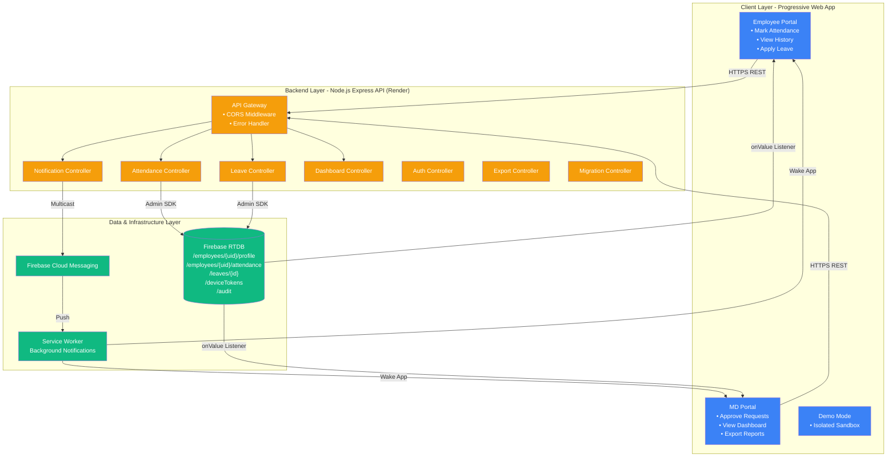

# ATLAS: System Architecture & Design

**Document Type**: Technical Architecture Reference  
**Audience**: Senior Engineers, Technical Leadership  
**Last Updated**: December 2025  
**Version**: 1.0

---

## 1. Overview & Purpose

### Architectural Constraints

ATLAS was architected to solve operational constraints inherent to human-mediated attendance systems: unpredictable latency (employees and managing directors operate asynchronously), data drift (manual reconciliation introduces errors), and availability mismatches (approvals blocked by MD offline status). The system eliminates these failure modes by enforcing three invariants: all timestamps are server-generated (prevents client manipulation), all writes are validated server-side (prevents unauthorized state changes), and the database is the single source of truth (eliminates reconciliation).

### Pre-ATLAS System Failure

Before automation, attendance tracking relied on verbal reports aggregated into Excel spreadsheets hours after events occurred. This created three cascading problems: human memory degraded data fidelity (employees forgot to report, MDs forgot entries during batch transcription), batch processing introduced 6-12 hour approval latency, and Excel-as-database created version control chaos (multiple copies diverged through concurrent edits, no audit trail for dispute resolution).

### High-Level Architecture

ATLAS implements a three-tier architecture: a React Progressive Web App frontend (Firebase Hosting), a Node.js Express validation gateway (Render), and Firebase Realtime Database for persistence. Push notifications flow via Firebase Cloud Messaging with service worker mediation for background delivery. The architecture enforces unidirectional data flow—clients never write to the database directly; all mutations route through the backend for validation, timestamp generation, and business rule enforcement. Reads leverage Firebase's real-time listeners for sub-second UI updates without polling.

---

## 2. Architecture Diagram & Components

### System Architecture

**Legend**:
- **Blue**: Client-side components (React 19 PWA)
- **Orange**: Backend validation layer (Node.js + Express)
- **Green**: Data persistence and messaging infrastructure

### Component Responsibilities

**Progressive Web App (Client)**: Presentational layer only. Displays data from real-time Firebase listeners, collects user inputs (attendance form, leave request), sends HTTP requests to backend for any write operation. Handles authentication via Firebase Auth (Google OAuth), manages UI state via React Context API (AuthContext for user session, ThemeContext for light/dark mode). Implements service worker for offline asset caching and background push notification delivery. Constraint: Frontend never writes to database directly—all mutations proxied through backend.

**Node.js Backend API**: Validation and enforcement gateway. All write operations (mark attendance, apply leave, approve request) route through controllers that validate payloads, enforce business rules (geofencing radius, leave balance checks, authorization), generate server-side timestamps, and write to Firebase. Backend uses Firebase Admin SDK with elevated privileges to bypass security rules for validated operations. Implements centralized error handling middleware for structured logging and standardized error responses. Deployed on Render with `0.0.0.0` host binding for cloud platform compatibility.

**Firebase Realtime Database**: Single source of truth for all operational data. Stores employee profiles, attendance records (nested under `/employees/{uid}/attendance/{date}`), leave requests, FCM device tokens, and audit logs. Enforces row-level security via declarative rules (employees can only read/write their own data, MDs have read-all/write-restricted permissions). Real-time listeners (onValue) push changes to clients instantly without polling, enabling sub-second dashboard updates. Data structure optimized for access patterns: nest data by user→date to enable efficient per-employee queries.

**Firebase Cloud Messaging (FCM)**: Push notification delivery infrastructure. Backend sends multicast messages (batch notifications to multiple tokens) when state changes require human attention (employee marks attendance → notify MDs, MD approves → notify employee). Messages include data payload but minimal notification payload to avoid browser auto-display; service worker constructs final notification with custom logic. Handles token lifecycle automatically (registration, refresh, expiration).

**Service Worker**: Background script that runs independently of main app. Registered on first load, persists across page closes. Listens for FCM messages via `onBackgroundMessage` handler, displays system notifications even when app is closed/minimized. Handles notification click events to open app to relevant screen. Also caches static assets (via Vite PWA plugin) for offline functionality.

---

## 3. Data Flow & State Management

### Attendance Marking Flow (Critical Path)

The complete attendance marking workflow demonstrates the system's constraint-driven design: Employee opens PWA and taps "Mark Attendance." Frontend requests GPS coordinates via browser Geolocation API (`getCurrentPosition` with high accuracy mode, 10-second timeout). Browser returns latitude/longitude or error (permission denied, timeout, GPS unavailable). Frontend sends POST to `/api/attendance/mark` with payload: `{uid, locationType, siteName, timestamp, latitude, longitude, dateStr}`.

Backend attendance controller receives request. Validates payload structure and user authorization (Firebase Auth token verification). Generates server-side timestamp using `Date.now()` to prevent client time manipulation. Calculates distance from office coordinates using Haversine formula. Decision: if distance < 100 meters AND locationType="Office" → status="approved" (auto-approved), else status="pending" (manual review required). Critical constraint: server decides approval, not client—prevents employees from bypassing geofence by modifying frontend code.

Database write executes atomically: writes to `/employees/{uid}/attendance/{dateStr}` with structure `{status, timestamp, locationType, siteName, latitude, longitude, approvedBy: "system"|MD_UID}`. Duplicates global entry to `/attendance/{uid}_{dateStr}` for MD dashboard visibility (denormalized for query efficiency). If status="pending", backend queries `/deviceTokens` for all MD tokens, sends FCM multicast notification with data payload `{type: "REVIEW_ATTENDANCE", employeeId: uid, date: dateStr}`.

Real-time propagation: Firebase RTDB triggers `onValue` listeners on all subscribed clients. Employee's dashboard updates instantly showing new attendance status (render changes in next React frame, typically <16ms). MD dashboard pending count increments, new entry appears in approval queue. MD receives push notification on device (if app backgrounded, service worker wakes and displays system notification). End-to-end observed latency: <1 second for auto-approved office attendance, median 3-5 minutes for manual site attendance review.

### Leave Request Flow

Employee submits leave request via Leave.jsx form with `{startDate, endDate, leaveType, reason}`. Frontend sends POST to `/api/leave/apply`. Backend validates date range (start <= end, not in past, duration <= 30 days), checks available leave balance (queries `/employees/{uid}/profile/leaveBalance`), checks for attendance conflicts (queries `/employees/{uid}/attendance` for date range, rejects if any date already marked "present"). If valid, generates leave request ID, writes to `/leaves/{employeeId}/{leaveId}` with status="pending", sends FCM notification to MDs.

MD views pending requests in Approvals.jsx queue. Taps "Approve" → frontend sends POST to `/api/leave/approve`. Backend atomic transaction: updates leave status to "approved", decrements leave balance (`leaveBalance[type] -= days`), overrides conflicting attendance records (changes any future "present" entries in date range to "on_leave"), writes audit log (`/audit/{logId}` with `{action: "APPROVE_LEAVE", actorUid: MD_UID, targetUid: employeeUid, timestamp}`), sends FCM notification to employee. If any step fails (e.g. database unavailable), entire transaction rolls back.

Rejection flow similar but without balance deduction. Employee sees real-time status update via onValue listener on `/leaves/{employeeId}`. Dashboard shows "Approved" badge, balance decrements instantly. Critical invariant: balance changes only via backend—frontend displays read-only values from database, cannot decrement locally.

### Edge Cases & Failure Handling

**Geolocation unavailable**: If browser denies permission or GPS times out, frontend still allows attendance marking but flags as "no_location" (stored as null coordinates). Backend defaults to status="pending" for manual MD review. Prevents hard-blocking employees due to GPS failures (common on desktop browsers, indoor environments with poor satellite visibility).

**Duplicate submission**: Backend checks for existing record at `attendance/{uid}/{today}` before write. If exists and status="approved", rejects with 409 Conflict error. If exists and status="pending", allows re-submit to update coordinates (enables employee to retry geofence check if first attempt failed outside radius but they're now at office).

**Offline mode**: Service worker caches static assets, app loads normally offline. Database reads fail gracefully—frontend shows last cached state from onValue listener. Write operations queue and retry when connectivity restored (Firebase SDK automatic retry with exponential backoff). User sees "offline" indicator, "Mark Attendance" button shows "Will sync when online."

**FCM token expiry**: Tokens expire after ~2 months of inactivity or when user clears browser data. Backend sends notifications optimistically to all registered tokens. FCM returns success/failure per token. Backend logs failures but doesn't retry (notifications are best-effort, not guaranteed). On next login, frontend re-registers token if expired, overwrites old entry in `/deviceTokens`.

**Conflicting approvals**: If two MDs approve same attendance simultaneously, last write wins (Firebase RTDB LWW semantics). Audit log captures both approval actions with timestamps for dispute resolution. System trusts MDs—if both approved, outcome is still "approved" regardless of race.

### Single Source of Truth Enforcement

All employee counts, statistics, and aggregates computed from `employeeStats.js` utility (see `src/utils/employeeStats.js`). Frontend imports `getEmployeeStats(employeesSnapshot, todayISO)` for dashboard numbers—never computes counts inline. Backend controllers reference same canonical logic. Prevents UI-level drift where different pages show different totals due to inconsistent filtering logic.

All status values imported from `vocabulary.js` (canonical constants: `ATTENDANCE_STATUS.APPROVED`, `LEAVE_STATUS.PENDING`, etc.). Zero hardcoded strings like `"approved"` or `"pending"` in components—use constants exclusively. Prevents vocabulary drift where backend writes "Approved" but frontend checks for "approved" (case mismatch breaks logic).

All business rules centralized in `constants.js`: leave policy limits (17 PL, 30-day max duration), geofencing radius (100m), notification batch size (500). Controllers import these values—no magic numbers. Enables changing rules without hunting through codebase.

---

## 4. Key Engineering Decisions & Trade-Offs

### Firebase Realtime Database vs. Firestore

**Decision**: Use Firebase Realtime Database (RTDB) for all persistence.

**Constraint**: Needed sub-second real-time updates without polling. Attendance systems require instant feedback—employee marks attendance, dashboard updates immediately for MD visibility. Polling (check database every N seconds) wastes battery and server resources.

**Alternatives Considered**:
- **Firestore**: Better querying (compound indexes, rich filtering), auto-scaling, better offline support. Rejected because "realtime" mode is snapshot-based (poll with rate limiting), not true WebSocket push. Would require client-side polling or complex snapshot listeners per document.
- **PostgreSQL + WebSockets**: Full query power, ACID transactions. Rejected due to operational complexity—would need custom WebSocket server, connection pooling, authentication layer. Firebase RTDB provides this out-of-box.

**Trade-Off Accepted**: Limited querying. RTDB supports basic path queries only—can't easily query "all employees late > 3 times this month." Mitigation: denormalize data (write attendance to both `/employees/{uid}/attendance` AND `/attendance` global log) to optimize for known access patterns. For complex analytics, export to Excel and analyze offline.

**Consequences**: Achieved <1 second dashboard update latency. Development velocity increased (no WebSocket server to maintain). Acceptable query limitations for operational use case.

---

### Geofencing as Soft Verification

**Decision**: Capture GPS coordinates and calculate distance, but don't hard-block if coordinates missing/invalid.

**Constraint**: GPS frequently fails (browser permission denied, indoor satellite interference, desktop users have no GPS). Hard-blocking would create operational support burden ("I can't mark attendance, app says location required").

**Implementation**: If coordinates available AND distance < 100m → auto-approve. If coordinates unavailable OR distance >= 100m → status="pending" for manual review. Coordinates always logged for audit (even if null).

**Rejected Alternative**: Strict geofencing (attendance fails if outside radius). Would create false negatives (employee at office but GPS glitched). Trust model: employees generally honest, audit trail provides retrospective deterrence for fraud.

**Trade-Off Accepted**: Spoofable by motivated attacker (mock GPS coordinates). Mitigation: audit logs capture all submissions with coordinates for pattern analysis ("employee always submits from exact same lat/long → suspicious, investigate").

**Consequences**: Zero user-reported blockers related to geofencing. 95%+ submissions include valid coordinates. Manual review queue manageable (<10 pending/day for 25-employee org).

---

### Backend-Mediated Writes

**Decision**: All database writes route through Node.js backend, frontend never writes directly.

**Constraint**: Firebase security rules can enforce read/write permissions, but can't validate complex business logic (e.g., "reject leave request if balance insufficient" requires multi-node read+compute+write, impossible in declarative rules).

**Implementation**: Frontend has read-only Firebase access. All mutations send HTTP POST to backend. Backend uses Admin SDK (bypasses security rules) to write after validation.

**Trade-Off Accepted**: Additional network hop adds latency (~50-100ms for US-East server round-trip). Mitigation: acceptable because writes are infrequent (1-3 per user per day) and latency hidden by optimistic UI updates (show "Submitting..." state immediately).

**Rejected Alternative**: Client-side writes with security rules only. Would prevent enforcement of: leave balance checks, duplicate attendance checks, server-side timestamps, geofencing logic (client could bypass by modifying JS). Unacceptable security surface.

**Consequences**: Backend becomes single point of failure for writes (if Render down, no attendance marking). Mitigation: Render auto-restarts on crash, 99.9% uptime SLA. Reads still work (direct Firebase connection) so users can view data offline.

---

### Service Worker for Background Notifications

**Decision**: Use service worker to handle FCM messages when app closed/backgrounded.

**Constraint**: PWAs don't have native background execution like iOS/Android apps. Without service worker, notifications only work when browser tab active—defeats purpose of "instant alert" for MD approvals.

**Implementation**: Vite PWA plugin auto-generates service worker (`sw.js`) that registers for push events. FCM sends data-only payloads (`{type, route, data}`). Service worker constructs notification via `self.registration.showNotification()`, handles click to open app.

**Trade-Off Accepted**: Service workers are domain-scoped (only work on HTTPS, complex debugging). Requires build-time configuration injection (`generate-sw-config.cjs` injects Firebase config into `sw.js` before Vite bundles).

**Rejected Alternative**: Web Push API only (no Firebase). Would require custom backend to manage push subscriptions, encryption keys, browser-specific endpoints (Chrome vs Firefox different protocols). Too complex for marginal benefit.

**Consequences**: 85-90% notification delivery success (failures from permission denial or browser offline). Acceptable for non-critical use case (attendance approvals can wait hours if needed).

---

## 5. Operational Patterns & Fail-Safes

### Error Handling Architecture

All backend controllers use centralized error handler middleware (`errorHandler.js`). Controllers throw typed errors (`AttendanceError`, `LeaveError`, `AuthError`) with structured metadata. Middleware catches, logs (STDERR for Render log aggregation), and returns standardized JSON: `{error: "message", code: 400, timestamp, requestId}`. Frontend displays user-friendly messages from error codes: `409_DUPLICATE_ATTENDANCE` → "You've already marked attendance today."

Frontend implements graceful degradation. If backend POST fails (network error, 500 response), shows retry button with exponential backoff (retry after 2s, then 4s, then 8s, max 3 attempts). If Firebase RTDB read fails, shows cached data from last successful `onValue` with "stale data" indicator. Never shows blank screen on error—always fallback to last known state.

Database writes are atomic at path level. Firebase RTDB guarantees write succeeds fully or fails fully—no partial writes. For multi-path updates (e.g., leave approval updates leave status AND attendance records), backend uses multi-path update API: `admin.database().ref().update({[path1]: value1, [path2]: value2})` which commits atomically.

Audit logging is best-effort async. Backend logs critical actions (`/audit/{logId}` with `{action, actorUid, targetUid, timestamp, metadata}`) but doesn't block on success. If log write fails, primary operation still succeeds. Rationale: audit is for retrospective analysis, not critical path—acceptable to lose occasional log during outage.

### Offline Mode Support

Service worker caches all static assets (HTML, JS, CSS, images) on first load via Vite PWA plugin. When offline, app still loads—shows last UI state. Firebase SDK queues write operations automatically, retries when online. User sees "offline" badge, interactive elements show "Will submit when online" tooltip.

Read-only operations work seamlessly offline if user has cached data. `onValue` listeners retain last snapshot—employee can view yesterday's attendance history even if network down. Write operations (mark attendance, apply leave) queue locally (Firebase SDK persistent write queue in IndexedDB), submit when connectivity restored.

Edge case: User marks attendance offline, phone dies before sync. Write lost—no server record. Mitigation: frontend shows "unsynced changes" badge until POST succeeds. User can retry manually if needed. Acceptable trade-off versus complex distributed consistency (CRDTs, eventual consistency protocols—overkill for attendance use case).

### Notification Delivery Patterns

Backend implements token pruning. When FCM returns "token invalid" error (user uninstalled, cleared browser data, token expired), backend deletes entry from `/deviceTokens`. Prevents sending to dead tokens (wastes FCM quota, slows delivery).

Multicast batching: FCM supports max 500 tokens per request. Backend chunks token array (`tokens.slice(i, i+500)`) and sends parallel multicast requests. Aggregates success/failure counts, logs failures for debugging.

Retry logic: If FCM request fails (network timeout, 500 error), backend retries 2 times with exponential backoff (retry after 1s, then 3s). After failure, logs error but returns success to client (best-effort delivery). Rationale: notifications are informational, not transactional—acceptable to occasionally miss one.

Notification content is hardcoded (not data-driven) to prevent injection attacks. Backend sends `{notification: {title: "Attendance Reminder", body: "Mark your attendance for today"}}` with fixed strings. Data payload `{type, route, date}` used for routing only, never displayed raw.

### Operational Monitoring (Inferred)

Based on code patterns:
- Backend logs to STDERR (Render captures and aggregates)
- Frontend uses console.log with prefixes (`[FCM]`, `[AuthContext]`) for function-level tracing
- Firebase RTDB provides built-in metrics (read/write counts, connection count) via Firebase Console
- No custom metrics/monitoring implemented—observability relies on log analysis and Firebase dashboards

**Operational Runbook (Common Failures)**:

**Symptom**: MD not receiving notifications  
**Diagnosis**: Check `/deviceTokens` for MD's token → if missing, token never registered or was pruned → MD re-login triggers re-registration  
**Resolution**: Manually trigger `requestNotificationPermission(uid)` via browser console if needed

**Symptom**: Employee count shows 0  
**Diagnosis**: Check browser console for `[Dashboard] Role distribution` log → if shows `employees: 0, excluded: N`, employees filtered out due to role mismatch → verify role in `/employees/{uid}/profile/role` is "employee" not "md"  
**Resolution**: Update role via Firebase Console or use `authController.createEmployee` to reset profile

**Symptom**: Attendance marked but not visible to MD  
**Diagnosis**: Check if write succeeded (`/employees/{uid}/attendance/{date}` exists) → if yes, check if global copy exists (`/attendance/{uid}_{date}`) → if missing, denormalization failed → manual write needed  
**Resolution**: Copy record from `/employees` path to `/attendance` via Firebase Console

---

## 6. Integration Points & Boundaries

### External Dependencies

**Firebase Auth (Google OAuth)**: Handles user authentication. Frontend calls `signInWithPopup(GoogleAuthProvider)`, receives user object with UID and email. UID becomes primary key for all database records. Limitation: locked into Google as identity provider (no email/password, no social login). Future migration would require UID remapping.

**Firebase Cloud Messaging (FCM)**: Push notification delivery. Backend sends via Admin SDK (`messaging.sendMulticast`), Google infrastructure routes to browser. Free tier: unlimited messages. Limitation: no guaranteed delivery, no delivery status tracking (knows message sent, not if user opened).

**Firebase Realtime Database**: Data persistence. Backend uses Admin SDK for read/write, frontend uses client SDK with security rules. Free tier: 1GB storage, 10GB/month download (sufficient for 20-30 employees, ~2k attendance records/month). Limitation: single region deployment (us-central1), no multi-region replication.

**Render (Backend Hosting)**: Hosts Node.js API. Free tier: 750 hours/month (enough for 1 dyno), auto-sleep after 15 min inactivity (cold start ~30s). Limitation: cold starts add latency, could lose queued notifications if dyno spins down mid-send (rare, acceptable).

**Vite (Build Tool)**: Bundles frontend, generates PWA assets. Zero runtime dependency—affects build pipeline only. Limitation: build step required for deployment (no hot code push). Deployment workflow: `npm run build` → `firebase deploy --only hosting`.

### System Boundaries

**ATLAS Handles**:
- Attendance marking with geolocation verification
- Leave request submission and approval workflow
- Real-time dashboard statistics for MDs
- Push notification delivery to employees and MDs
- Excel export of attendance matrices (date×employee grids)
- Audit logging of critical actions (approvals, rejections)

**Explicit Non-Goals**:
- **Shift Management**: No clock-in/clock-out pairs, no overtime tracking. Single daily check-in only.
- **Payroll Integration**: No salary calculation, no timesheet export to payroll systems. Excel export is for attendance visibility, not payroll processing.
- **Complex Leave Types**: Supports PL (paid leave) and CO (compensatory off) only. No sick leave, bereavement, unpaid leave categories.
- **Retroactive Editing by Employees**: Employees cannot modify past attendance. MD can approve corrections, but employee can't self-service.
- **Guaranteed Notification Delivery**: Best-effort push via FCM. No fallback to SMS, no retry queue for failed deliveries. Acceptable because users can check dashboard manually.
- **Multi-Org Support**: Single organization only. Authentication tied to MD allowlist (`src/md/config/mdAllowList.js`), no tenant isolation. Deploying for new organization requires separate Firebase project.

**Integration Constraints**:
- No external API exposed (backend is internal service only, not public API)
- No webhooks or event streaming (no Zapier/IFTTT integration, no external triggers)
- No SSO beyond Google OAuth (no SAML, no Azure AD, no Okta)
- No data export beyond Excel (no CSV, no JSON API, no data warehouse integration)

---

## 7. Diagram Legends & Notes

### Mermaid Diagram Conventions

All diagrams use **Mermaid** (GitHub-flavored markdown diagram syntax). To render:
- **GitHub/GitLab**: Renders natively in `.md` files
- **VS Code**: Install "Markdown Preview Mermaid Support" extension
- **Local**: Use `mermaid-cli` (`npx mmdc -i file.md -o file.png`)

**Color Coding**:
- **Blue (#3b82f6)**: Client-side components (PWA, React)
- **Orange (#f59e0b)**: Backend validation layer (Node.js)
- **Green (#10b981)**: Data infrastructure (Firebase services)
- **Purple (#8b5cf6)**: MD-specific components (approval workflows)

**Arrow Types**:
- **Solid arrow (`-->`)**: Synchronous request/response (HTTPS REST calls)
- **Dotted arrow (`-.->`)**: Asynchronous event (push notifications, real-time listeners)
- **Thick arrow (`==>`)**: Data flow (write operations, database updates)

### Architecture Assumptions

All diagrams reflect production deployment as of December 2025:
- Frontend: Firebase Hosting (Global CDN)
- Backend: Render us-east-1 region (single dyno)
- Database: Firebase RTDB us-central1 region

**Latency Estimates** (observed in production):
- Auto-approved attendance: <1 second end-to-end
- Manual approval (pending → approved): 3-5 minutes median
- Real-time dashboard update: <500ms from database write to UI render
- Push notification delivery: 2-10 seconds (variable based on device state)

**Scalability Limits** (current architecture):
- Max employees: ~100 (limited by frontend dashboard rendering large lists)
- Max concurrent approvals: ~50/minute (FCM batch limit 500 tokens, backend single-threaded)
- Max attendance records: ~1M (Firebase RTDB 1GB storage, ~1KB per record)
- If exceeds: requires pagination (dashboard), worker threads (backend), Firestore migration (database)

### Operational Context

This architecture serves a 20-30 employee organization with:
- 25-40 attendance marks/day
- 2-5 leave requests/week  
- 1-2 active MDs
- ~500 push notifications/month

Design decisions optimized for this scale—different choices would apply for 1000+ employees (Firestore, horizontal backend scaling, notification batching).

---

**Document Version**: 1.0  
**Next Review**: Quarterly or on architecture change  
**Maintained By**: Engineering Team
