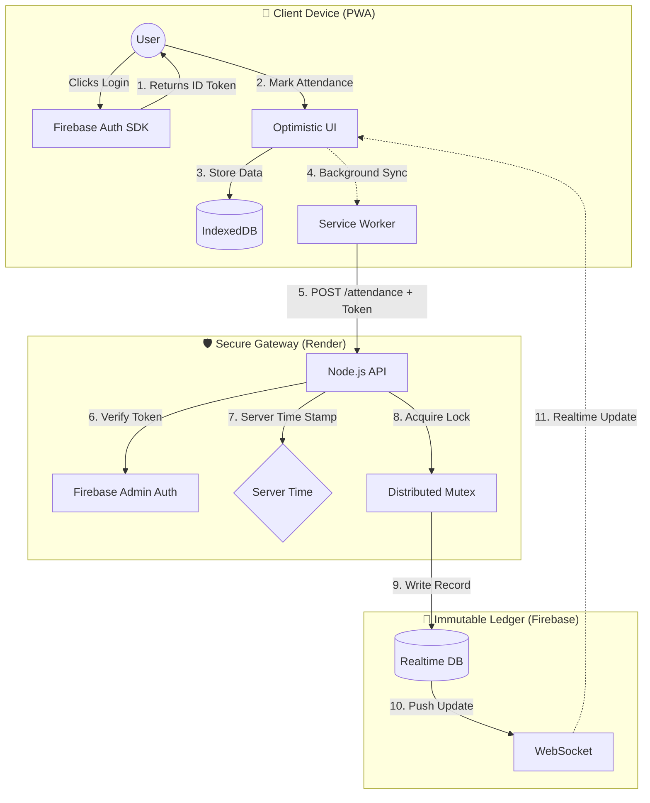

# ATLAS System Workflow & Architecture

## System Overview
The following diagram illustrates the "Backend Monopoly" architecture, where the Client is treated as hostile and all state mutations must pass through the Render Gateway.

## Detailed Data Flows

### 1. Authentication & Routing
1.  **Login:** `authService.loginWithGoogle()` triggers popup.
2.  **Token:** Firebase returns JWT.
3.  **Role Check:** `App.tsx` (`RoleDispatcher`) checks `token.claims.role`.
    *   `role: 'owner'` -> `/owner`
    *   `role: 'md'` -> `/md`
    *   `role: 'employee'` -> `/employee`

### 2. Attendance (The "Iron Dome" Path)
1.  **Capture:** User takes selfie. Location is *not* captured (Zero Trust).
2.  **Queue:** Data saved to `IndexedDB` (`/workbox-background-sync`).
3.  **Transport:** `POST https://atlas-backend.onrender.com/api/v1/attendance`.
4.  **Validation:**
    *   `verifyToken`: Is the JWT valid?
    *   `rateLimit`: Max 1 req/min.
    *   `zod`: Is photo valid Base64?
5.  **Mutation:** Server acquires lock `locks/uid`. Writes to `attendance/YYYY-MM/DD/uid`.

### 3. Leave Approval
1.  **Request:** Employee POSTs leave request.
2.  **Notification:** Backend triggers FCM to MD.
3.  **Approval:** MD clicks "Approve" (authenticated request).
4.  **Update:** Server updates `leaves/id/status = 'Approved'`.
5.  **Feedback:** Employee sees green checkmark (via RTDB Listener).

## Component Map
*   **Frontend:** `src/features/employee/pages/EmployeeDashboard.tsx`
*   **State:** `TanStack Query` (Client State) + `Firebase SDK` (Auth State).
*   **Backend:** `server/src/controllers/attendanceController.js`.
