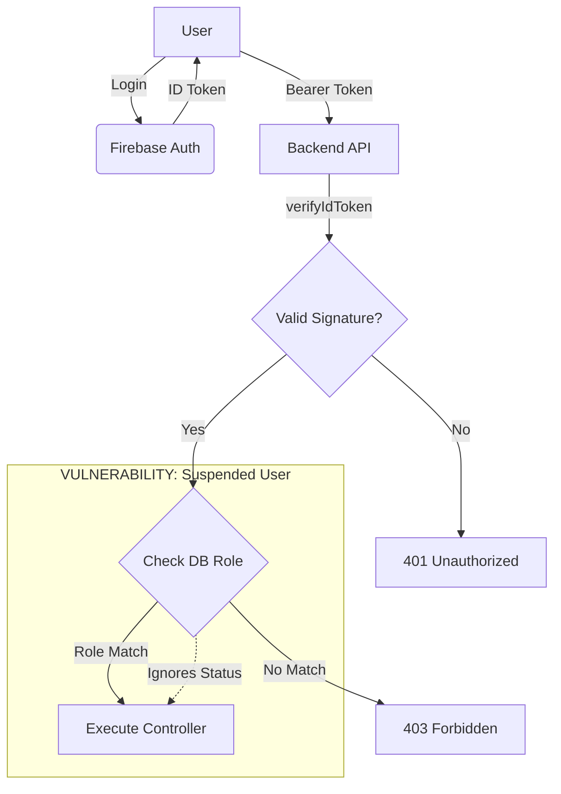

# Security Audit Report
**Date:** 2026-01-24
**Scope:** Authentication & Authorization System

## 1. Current Authentication Flows

### Login Flow
1.  **Frontend**: User clicks "Login with Google".
2.  **SDK**: `signInWithPopup(auth, googleProvider)` is called.
3.  **Frontend**: `authService.signInWithGoogle` receives `UserCredential`.
4.  **Frontend**: Checks `employees/${uid}` in Realtime DB.
    *   *If missing:* Attempts to write default profile to `employees/${uid}`.
    *   *Failure:* Write fails due to `database.rules.json` requiring 'owner' role.
    *   *Result:* User is authenticated in Firebase but has no DB profile (Zombie).

### API Authentication
1.  **Client**: Sends HTTP Request with `Authorization: Bearer <ID_TOKEN>`.
2.  **Server (`app.js`)**: Routes to `api.js`.
3.  **Middleware (`authMiddleware.js`)**:
    *   `verifyToken`: Decodes JWT using `admin.auth().verifyIdToken()`.
    *   `verifyTokenAndRole`: Fetches `employees/${uid}/profile/role` from RTDB.
4.  **Controller**: Executes business logic if role matches.

## 2. Authorization Mechanisms

### Fragmented Authorization
*   **Backend API**: Trusts **Realtime Database** (`employees` node).
*   **Firebase SDK (Client)**: Trusts **Security Rules** (custom claims).
*   **Risk**: If DB role changes, API reflects it instantly, but Client SDK (and Security Rules) respect the old JWT claim for up to 1 hour.

### User Status Handling
*   **Active User**: `status: "active"`. Full access.
*   **Suspended User**: `status: "suspended"`.
    *   *Frontend*: Hides UI elements.
    *   *Backend*: **IGNORES** status field. Only checks `role`.
    *   *Result*: Suspended users retain full API access.

## 3. Data Stores & Schema

### `employees` (Realtime DB)
*   **Source of Truth** for profiles.
*   **Path**: `employees/${uid}/profile`.
*   **Fields**: `role`, `status`, `email`, `name`.
*   **Access**: Read (Self/Admin), Write (Admin only).

### `users` (Legacy Realtime DB)
*   **Status**: Deprecated but active.
*   **Path**: `users/${uid}`.
*   **Usage**: `UnifiedProfile.tsx` reads/writes phone numbers here.
*   **Risk**: Unvalidated data store.

## 4. Middleware Inventory

### `verifyToken`
*   **File**: `server/src/middleware/authMiddleware.js`
*   **Action**: Verifies JWT signature and expiry.
*   **Missing**: Revocation check (`checkRevoked: true`), Status check.

### `verifyTokenAndRole`
*   **File**: `server/src/middleware/authMiddleware.js`
*   **Action**: Verifies JWT + Fetches DB Role.
*   **Missing**: Status check (`active` vs `suspended`).

## 5. Visual Flow Diagram (Text)

